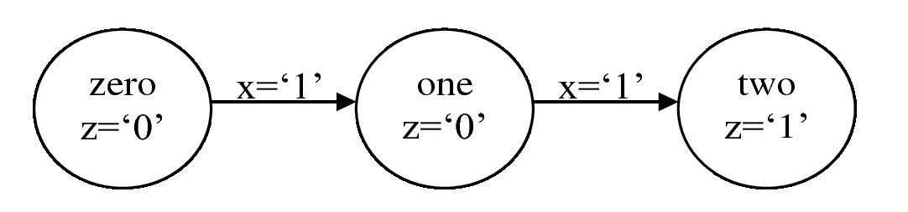
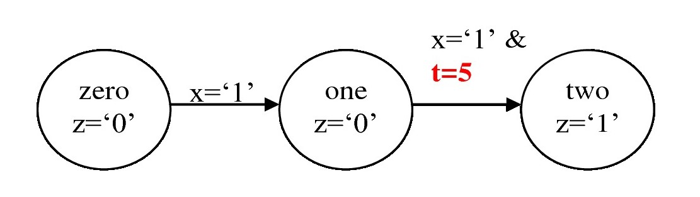
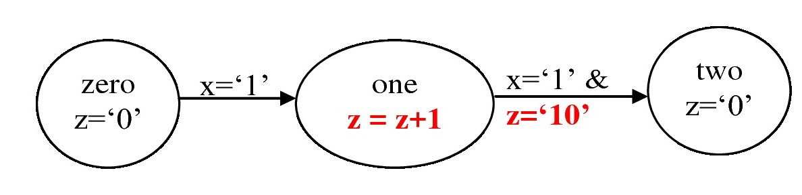

### Mealy machine vs Moore machine

- In previous chapters, we saw various examples of the combinational circuits and sequential circuits. In combinational circuits, the output depends on the current values of inputs only; whereas in sequential circuits, the output depends on the current values of the inputs along with the previously stored information. In the other words, storage elements, e.g. flip flogs or registers, are required for sequential circuits. The information stored in these elements can be seen as the states of the system.
- If a system transits between finite number of such internal states, then finite state machines (FSM) can be used to design the system. The FSM designed can be classified as ‘Moore machine’ and ‘Mealy machine’ which are discussed in this chapter.
- Mealy machine requires fewer number of states as compared to Moore machine.
- Moore machine should be preferred for the designs, where glitches are not the problem in the systems.
- Mealy machines are good for synchronous systems which requires ‘delay-free and glitch-free’ system, but careful design is required for asynchronous systems. Therefore, Mealy machine can be complex as compare to Moore machine.

### Glitches

- Glitches are the short duration pulses which are generated in the combinational circuits. These are generated when more than two inputs change their values simultaneously. Glitches can be categorized as ‘static glitches’ and ‘dynamic glitches’.
- Static glitches are further divided into two groups i.e. `static-0` and `static-1`. `Static-0` glitch is the glitch which occurs in logic-0 signal i.e. one short pulse `high-pulse (logic-1)` appears in logic-0 signal (and the signal settles down).
- Dynamic glitch is the glitch in which multiple short pulses appear before the signal settles down.

### Moore architecture and VHDL templates

- Moore and Mealy machines can be divided into three categories i.e. ‘regular’, ‘timed’ and ‘recursive’. The differences in these categories are shown in the figures below for Moore machine.

<br>

- In regular Moore machine,
  - Outputs depend on current external inputs.
  - Next states depend on current states and current external inputs.

<div align="center">
    
     <figcaption>Regular Moore machine</figcaption>
</div>
<br>

- In timed Moore machine,
  - Outputs depend on current external inputs.
  - Next states depend on time along with current states and current external inputs.

<div align="center">
    
    <figcaption>Timed Moore machine : next state depends on time as well</figcaption>
</div>
<br>

- In recursive Moore machine,
  - Outputs depend on current external inputs. Also, values in the feedback registers are used as outputs.
  - Next states depend current states, current external input, current internal inputs (i.e. previous outputs feedback as inputs to system) and time (optional).

<div align="center">
    
     <figcaption>Recursive Moore machine : output ‘z’ depends on output i.e. feedback required</figcaption>
</div>

<br>

#### Regular Machine

- VHDL template for regular Moore FSM : separate ‘next_state’ and ‘output’ logic

```vhdl
library ieee;
use ieee.std_logic_1164.all;
use ieee.numeric_std.all;

entity moore_regular_template is
generic (
    param1 : std_logic_vector(...) := <value>;
    param2 : unsigned(...) := <value>
    );
port (
    clk, reset : in std_logic;
    input1, input2, ... : in std_logic_vector(...);
    output1, output2, ... : out signed(...)
);
end entity;

architecture arch of moore_regular_template is
    type stateType is (s0, s1, s2, s3, ...);
    signal state_reg, state_next : stateType;
begin
    -- state register : state_reg
    -- This process contains sequential part and all the D-FF are
    -- included in this process. Hence, only 'clk' and 'reset' are
    -- required for this process.
    process(clk, reset)
    begin
        if reset = '1' then
            state_reg <= s1;
        elsif (clk) then
            state_reg <= state_next;
        end if;
    end process;

    -- next state logic : state_next
    -- This is combinational of the sequential design,
    -- which contains the logic for next-state
    -- include all signals and input in sensitive-list except state_next
    process(input1, input2, state_reg)
    begin
        state_next <= state_reg; -- default state_next
        case state_reg is
            when s0 =>
                if <condition> then -- if (input1 = '01') then
                    state_next <= s1;
                elsif <condition> then  -- add all the required conditionstions
                    state_next <= ...;
                else -- remain in current state
                    state_next <= s0;
                end if;
            when s1 =>
                if <condition> then -- if (input1 = '10') then
                    state_next <= s2;
                elsif <condition> then  -- add all the required conditionstions
                    state_next <= ...;
                else -- remain in current state
                    state_next <= s1;
                end if;
            when s2 =>
                ...
        end case;
    end process;

    -- combination output logic
    -- This part contains the output of the design
    -- no if-else statement is used in this part
    -- include all signals and input in sensitive-list except state_next
    process(input1, input2, ..., state_reg)
    begin
        -- default outputs
        output1 <= <value>;
        output2 <= <value>;
        ...
        case state_reg is
            when s0 =>
                output1 <= <value>;
                output2 <= <value>;
                ...
            when s1 =>
                output1 <= <value>;
                output2 <= <value>;
                ...
            when s2 =>
                ...
        end case;
    end process;

    -- optional D-FF to remove glitches
    process(clk, reset)
    begin
        if reset = '1' then
            new_output1 <= ... ;
            new_output2 <= ... ;
        elsif rising_edge(clk) then
            new_output1 <= output1;
            new_output2 <= output2;
        end if;
    end process;
end architecture;
```

- VHDL template for regular Moore FSM : combined ‘next_state’ and ‘output’ logic

```vhdl
library ieee;
use ieee.std_logic_1164.all;
use ieee.numeric_std.all;

entity moore_regular_template2 is
generic (
    param1 : std_logic_vector(...) := <value>;
    param2 : unsigned(...) := <value>
    );
port (
    clk, reset : in std_logic;
    input1, input2, ... : in std_logic_vector(...);
    output1, output2, ... : out signed(...)
);
end entity;

architecture arch of moore_regular_template2 is
    type stateType is (s0, s1, s2, s3, ...);
    signal state_reg, state_next : stateType;
begin
    -- state register : state_reg
    -- This process contains sequential part and all the D-FF are
    -- included in this process. Hence, only 'clk' and 'reset' are
    -- required for this process.
    process(clk, reset)
    begin
        if reset = '1' then
            state_reg <= s1;
        elsif (clk) then
            state_reg <= state_next;
        end if;
    end process;

    -- next state logic and outputs
    -- This is combinational of the sequential design,
    -- which contains the logic for next-state and outputs
    -- include all signals and input in sensitive-list except state_next
    process(input1, input2, ..., state_reg)
    begin
        state_next <= state_reg; -- default state_next
        -- default outputs
        output1 <= <value>;
        output2 <= <value>;
        ...
        case state_reg is
            when s0 =>
                output1 <= <value>;
                output2 <= <value>;
                ...
                if <condition> then -- if (input1 = '01') then
                    state_next <= s1;
                elsif <condition> then  -- add all the required conditionstions
                    state_next <= ...;
                else -- remain in current state
                    state_next <= s0;
                end if;
            when s1 =>
                output1 <= <value>;
                output2 <= <value>;
                ...
                if <condition> then -- if (input1 = '10') then
                    state_next <= s2;
                elsif <condition> then  -- add all the required conditionstions
                    state_next <= ...;
                else -- remain in current state
                    state_next <= s1;
                end if;
            when s2 =>
                ...
        end case;
    end process;

    -- optional D-FF to remove glitches
    process(clk, reset)
    begin
        if reset = '1' then
            new_output1 <= ... ;
            new_output2 <= ... ;
        elsif rising_edge(clk) then
            new_output1 <= output1;
            new_output2 <= output2;
        end if;
    end process;
end architecture;
```

#### Timed Machine

- If the state of the design changes after certain duration, then we need to add the timer in the VHDL design which are created in `Regular Moore FSM template`. For this, we need to add one more process-block which performs following actions:

  - Zero the timer : The value of the timer is set to zero, whenever the state of the system changes.
  - Stop the timer : Value of the timer is incremented till the predefined ‘maximum value’ is reached and then it should be stopped incrementing. Further, it’s value should not be set to zero until state is changed.
    <br>

- VHDL template timed Moore FSM : separate ‘next_state’ and ‘output’ logic

```vhdl
library ieee;
use ieee.std_logic_1164.all;
use ieee.numeric_std.all;

entity moore_timed_template is
generic (
    param1 : std_logic_vector(...) := <value>;
    param2 : unsigned(...) := <value>
    );
port (
    clk, reset : in std_logic;
    input1, input2, ... : in std_logic_vector(...);
    output1, output2, ... : out signed(...)
);
end entity;

architecture arch of moore_timed_template is
    type stateType is (s0, s1, s2, s3, ...);
    signal state_reg, state_next : stateType;

    -- timer
    constant T1 : natural := <value>;
    constant T2 : natural := <value>;
    constant T3 : natural := <value>;
    ...
    signal t : natural;
begin
    -- state register : state_reg
    -- This process contains sequential part and all the D-FF are
    -- included in this process. Hence, only 'clk' and 'reset' are
    -- required for this process.
    process(clk, reset)
    begin
        if reset = '1' then
            state_reg <= s1;
        elsif (clk) then
            state_reg <= state_next;
        end if;
    end process;

    -- timer
    process(clk, reset)
    begin
        if reset = '1' then
            t <= 0;
        elsif rising_edge(clk) then
            if state_reg /= state_next then  -- state is changing
                t <= 0;
            else
                t <= t + 1;
            end if;
        end if;
    end process;

    -- next state logic : state_next
    -- This is combinational of the sequential design,
    -- which contains the logic for next-state
    -- include all signals and input in sensitive-list except state_next
    process(input1, input2, state_reg)
    begin
        state_next <= state_reg; -- default state_next
        case state_reg is
            when s0 =>
                if <condition> and t >= T1-1 then -- if (input1 = '01') then
                    state_next <= s1;
                elsif <condition> and t >= T2-1 then  -- add all the required conditionstion
                    state_next <= ...;
                else -- remain in current state
                    state_next <= s0;
                end if;
            when s1 =>
                if <condition> and t >= T3-1 then -- if (input1 = '10') then
                    state_next <= s2;
                elsif <condition> and t >= T2-1 then  -- add all the required conditionstions
                    state_next <= ...;
                else -- remain in current state
                    state_next <= s1;
                end if;
            when s2 =>
                ...
        end case;
    end process;

    -- combination output logic
    -- This part contains the output of the design
    -- no if-else statement is used in this part
    -- include all signals and input in sensitive-list except state_next
    process(input1, input2, ..., state_reg)
    begin
        -- default outputs
        output1 <= <value>;
        output2 <= <value>;
        ...
        case state_reg is
            when s0 =>
                output1 <= <value>;
                output2 <= <value>;
                ...
            when s1 =>
                output1 <= <value>;
                output2 <= <value>;
                ...
            when s2 =>
                ...
        end case;
    end process;

    -- optional D-FF to remove glitches
    process(clk, reset)
    begin
        if reset = '1' then
            new_output1 <= ... ;
            new_output2 <= ... ;
        elsif rising_edge(clk) then
            new_output1 <= output1;
            new_output2 <= output2;
        end if;
    end process;
end architecture;
```

#### Recursive Machine

In recursive machine, the outputs are fed back as input to the system. Hence, we need additional process-statement which can store the outputs which are fed back to combinational block of sequential design. The code below is same as `Timed Moore FSM template` except certain signals and process block are defined to feedback the output to combination logic.

- VHDL template recursive Moore FSM : separate ‘next_state’ and ‘output’ logic

```vhdl
library ieee;
use ieee.std_logic_1164.all;
use ieee.numeric_std.all;

entity moore_recursive_template is
generic (
    param1 : std_logic_vector(...) := <value>;
    param2 : unsigned(...) := <value>
    );
port (
    clk, reset : in std_logic;
    input1, input2, ... : in std_logic_vector(...);
    -- inout is used here as we are reading output1 and output2
    new_output1, new_output2, output1, output2, ... : inout signed(...)
);
end entity;

architecture arch of moore_recursive_template is
    type stateType is (s0, s1, s2, s3, ...);
    signal state_reg, state_next : stateType;

    -- timer (optional)
    constant T1 : natural := <value>;
    constant T2 : natural := <value>;
    constant T3 : natural := <value>;
    ...
    constant tmax : natural := <value>; -- tmax >= max(T1, T2, ...)-1
    signal t : natural range 0 to tmax;

    -- recursive : feedback register
    signal r1_reg, r1_next : std_logic_vector(...) := <value>;
    signal r2_reg, r2_next : signed(...) := <value>;
    ...
begin
    -- state register : state_reg
    -- This process contains sequential part and all the D-FF are
    -- included in this process. Hence, only 'clk' and 'reset' are
    -- required for this process.
    process(clk, reset)
    begin
        if reset = '1' then
            state_reg <= s1;
        elsif (clk) then
            state_reg <= state_next;
        end if;
    end process;

    -- timer (optional)
    process(clk, reset)
    begin
        if reset = '1' then
            t <= 0;
        elsif rising_edge(clk) then
            if state_reg /= state_next then  -- state is changing
                t <= 0;
            elsif t /= tmax then
                t <= t + 1;
            end if;
        end if;
    end process;

    -- feedback registers: to feedback the outputs
    process(clk, reset)
    begin
        if (reset = '1') then
            r1_reg <= <initial_value>;
            r2_reg <= <initial_value>;
            ...
        elsif rising_edge(clk) then
            r1_reg <= r1_next;
            r2_reg <= r2_next;
            ...
        end if;
    end process;

    -- next state logic : state_next
    -- This is combinational of the sequential design,
    -- which contains the logic for next-state
    -- include all signals and input in sensitive-list except state_next
    process(input1, input2, state_reg)
    begin
        state_next <= state_reg; -- default state_next
        r1_next <= r1_reg; -- default next-states
        r2_next <= r2_reg;
        ...
        case state_reg is
            when s0 =>
                if <condition> and r1_reg = <value> and t >= T1-1 then -- if (input1 = '01') then
                    state_next <= s1;
                    r1_next <= <value>;
                    r2_next <= <value>;
                    ...
                elsif <condition> and r2_reg = <value> and t >= T2-1 then  -- add all the required conditions
                    state_next <= <value>;
                    r1_next <= <value>;
                    ...
                else -- remain in current state
                    state_next <= s0;
                    r2_next <= <value>;
                    ...
                end if;
            when s1 =>
                ...
        end case;
    end process;

    -- combination output logic
    -- This part contains the output of the design
    -- no if-else statement is used in this part
    -- include all signals and input in sensitive-list except state_next
    process(input1, input2, ..., state_reg)
    begin
        -- default outputs
        output1 <= <value>;
        output2 <= <value>;
        ...
        case state_reg is
            when s0 =>
                output1 <= <value>;
                output2 <= <value>;
                ...
            when s1 =>
                output1 <= <value>;
                output2 <= <value>;
                ...
            when s2 =>
                ...
        end case;
    end process;

    -- optional D-FF to remove glitches
    process(clk, reset)
    begin
        if reset = '1' then
            new_output1 <= ... ;
            new_output2 <= ... ;
        elsif rising_edge(clk) then
            new_output1 <= output1;
            new_output2 <= output2;
        end if;
    end process;
end architecture;
```

### Mealy architecture and VHDL template

Template for Mealy architecture is similar to Moore architecture. The minor changes are required as outputs depend on current input as well.

#### Regular machine

In Mealy machines, the output is the function of current input and states, therefore the output will also defined inside the if-statements

- VHDL template for regular Mealy FSM : combined ‘next_state’ and ‘output’ logic

```vhdl
library ieee;
use ieee.std_logic_1164.all;
use ieee.numeric_std.all;

entity mealy_regular_template is
generic (
    param1 : std_logic_vector(...) := <value>;
    param2 : unsigned(...) := <value>
    );
port (
    clk, reset : in std_logic;
    input1, input2, ... : in std_logic_vector(...);
    output1, output2, ... : out signed(...)
);
end entity;

architecture arch of mealy_regular_template is
    type stateType is (s0, s1, s2, s3, ...);
    signal state_reg, state_next : stateType;
begin
    -- state register : state_reg
    -- This process contains sequential part and all the D-FF are
    -- included in this process. Hence, only 'clk' and 'reset' are
    -- required for this process.
    process(clk, reset)
    begin
        if reset = '1' then
            state_reg <= s1;
        elsif (clk) then
            state_reg <= state_next;
        end if;
    end process;

    -- next state logic and outputs
    -- This is combinational of the sequential design,
    -- which contains the logic for next-state and outputs
    -- include all signals and input in sensitive-list except state_next
    process(input1, input2, ..., state_reg)
    begin
        state_next <= state_reg; -- default state_next
        -- default outputs
        output1 <= <value>;
        output2 <= <value>;
        ...
        case state_reg is
            when s0 =>
                if <condition> then -- if (input1 = '01') then
                    output1 <= <value>;
                    output2 <= <value>;
                    ...
                    state_next <= s1;
                elsif <condition> then  -- add all the required conditionstions
                    output1 <= <value>;
                    output2 <= <value>;
                    ...
                    state_next <= ...;
                else -- remain in current state
                    output1 <= <value>;
                    output2 <= <value>;
                    ...
                    state_next <= s0;
                end if;
            when s1 =>
                ...
        end case;
    end process;

    -- optional D-FF to remove glitches
    process(clk, reset)
    begin
        if reset = '1' then
            new_output1 <= ... ;
            new_output2 <= ... ;
        elsif rising_edge(clk) then
            new_output1 <= output1;
            new_output2 <= output2;
        end if;
    end process;
end architecture;
```

#### Timed machine

- VHDL template for timed Mealy FSM : combined ‘next_state’ and ‘output’ logic

```vhdl
library ieee;
use ieee.std_logic_1164.all;
use ieee.numeric_std.all;

entity mealy_timed_template is
generic (
    param1 : std_logic_vector(...) := <value>;
    param2 : unsigned(...) := <value>
    );
port (
    clk, reset : in std_logic;
    input1, input2, ... : in std_logic_vector(...);
    output1, output2, ... : out signed(...)
);
end entity;

architecture arch of mealy_timed_template is
    type stateType is (s0, s1, s2, s3, ...);
    signal state_reg, state_next : stateType;

    -- timer
    constant T1 : natural := <value>;
    constant T2 : natural := <value>;
    constant T3 : natural := <value>;
    ...
    signal t : natural;
begin
    -- state register : state_reg
    -- This process contains sequential part and all the D-FF are
    -- included in this process. Hence, only 'clk' and 'reset' are
    -- required for this process.
    process(clk, reset)
    begin
        if reset = '1' then
            state_reg <= s1;
        elsif (clk) then
            state_reg <= state_next;
        end if;
    end process;

    -- timer
    process(clk, reset)
    begin
        if reset = '1' then
            t <= 0;
        elsif rising_edge(clk) then
            if state_reg /= state_next then  -- state is changing
                t <= 0;
            else
                t <= t + 1;
            end if;
        end if;
    end process;

    -- next state logic and outputs
    -- This is combinational of the sequential design,
    -- which contains the logic for next-state and outputs
    -- include all signals and input in sensitive-list except state_next
    process(input1, input2, ..., state_reg)
    begin
        state_next <= state_reg; -- default state_next
        -- default outputs
        output1 <= <value>;
        output2 <= <value>;
        ...
        case state_reg is
            when s0 =>
                if <condition> and t >= T1-1 then -- if (input1 = '01') then
                    output1 <= <value>;
                    output2 <= <value>;
                    ...
                    state_next <= s1;
                elsif <condition> and t >= T2-1 then  -- add all the required conditionstions
                    output1 <= <value>;
                    output2 <= <value>;
                    ...
                    state_next <= ...;
                else -- remain in current state
                    output1 <= <value>;
                    output2 <= <value>;
                    ...
                    state_next <= s0;
                end if;
            when s1 =>
                ...
        end case;
    end process;

    -- optional D-FF to remove glitches
    process(clk, reset)
    begin
        if reset = '1' then
            new_output1 <= ... ;
            new_output2 <= ... ;
        elsif rising_edge(clk) then
            new_output1 <= output1;
            new_output2 <= output2;
        end if;
    end process;
end architecture;
```

#### Recursive machine

- VHDL template for recursive Mealy FSM : combined ‘next_state’ and ‘output’ logic

```vhdl
library ieee;
use ieee.std_logic_1164.all;
use ieee.numeric_std.all;

entity mealy_recursive_template is
generic (
    param1 : std_logic_vector(...) := <value>;
    param2 : unsigned(...) := <value>
    );
port (
    clk, reset : in std_logic;
    input1, input2, ... : in std_logic_vector(...);
    -- inout is used here as we are reading output1 and output2
    new_output1, new_output2, output1, output2, ... : inout signed(...)
);
end entity;

architecture arch of mealy_recursive_template is
    type stateType is (s0, s1, s2, s3, ...);
    signal state_reg, state_next : stateType;

    -- timer (optional)
    constant T1 : natural := <value>;
    constant T2 : natural := <value>;
    constant T3 : natural := <value>;
    ...
    constant tmax : natural := <value>; -- tmax >= max(T1, T2, ...)-1
    signal t : natural range 0 to tmax;

    -- recursive : feedback register
    signal r1_reg, r1_next : std_logic_vector(...) := <value>;
    signal r2_reg, r2_next : signed(...) := <value>;
    ...
begin
    -- state register : state_reg
    -- This process contains sequential part and all the D-FF are
    -- included in this process. Hence, only 'clk' and 'reset' are
    -- required for this process.
    process(clk, reset)
    begin
        if reset = '1' then
            state_reg <= s1;
        elsif (clk) then
            state_reg <= state_next;
        end if;
    end process;

    -- timer (optional)
    process(clk, reset)
    begin
        if reset = '1' then
            t <= 0;
        elsif rising_edge(clk) then
            if state_reg /= state_next then  -- state is changing
                t <= 0;
            elsif t /= tmax then
                t <= t + 1;
            end if;
        end if;
    end process;

    -- feedback registers: to feedback the outputs
    process(clk, reset)
    begin
        if (reset = '1') then
            r1_reg <= <initial_value>;
            r2_reg <= <initial_value>;
            ...
        elsif rising_edge(clk) then
            r1_reg <= r1_next;
            r2_reg <= r2_next;
            ...
        end if;
    end process;

    -- next state logic and outputs
    -- This is cominatinal part of the sequential design,
    -- which contains the logic for next-state and outputs
    -- include all signals and input in sensitive-list except state_next
    process(input1, input2, ..., state_reg)
    begin
        state_next <= state_reg; -- default state_next
        -- default outputs
        output1 <= <value>;
        output2 <= <value>;
        ...
        -- default next-states
        r1_next <= r1_reg;
        r2_next <= r2_reg;
        ...
        case state_reg is
            when s0 =>
                if <condition> and r1_reg = <value> and t >= T1-1 then -- if (input1 = '01') then
                    output1 <= <value>;
                    output2 <= <value>;
                    ...
                    r1_next <= <value>;
                    r2_next <= <value>;
                    ...
                    state_next <= s1;
                elsif <condition> and r2_reg = <value> and t >= T2-1 then  -- add all the required coditions
                    output1 <= <value>;
                    output2 <= <value>;
                    ...
                    r1_next <= <value>;
                    ...
                    state_next <= ...;
                else -- remain in current state
                    output1 <= <value>;
                    output2 <= <value>;
                    ...
                    r2_next <= <value>;
                    ...
                    state_next <= s0;
                end if;
            when s1 =>
                ...
        end case;
    end process;

    -- optional D-FF to remove glitches
    process(clk, reset)
    begin
        if reset = '1' then
            new_output1 <= ... ;
            new_output2 <= ... ;
        elsif rising_edge(clk) then
            new_output1 <= output1;
            new_output2 <= output2;
        end if;
    end process;
end architecture;
```

### When to use FSM design

We saw in previous sections that, once we have the state diagram for the FSM design, then the VHDL design is a straightforward process. But, it is important to understand the correct conditions for using the FSM, otherwise the circuit will become complicated unnecessary.

- We should not use the FSM diagram, if there is only ‘one loop’ with ‘zero or one control input’. ‘Counter’ is a good example for this. A 10-bit counter has 10 states with no control input (i.e. it is free running counter). This can be easily implemented without using FSM. If we implement it with FSM, then we need 10 states; and the code and corresponding design will become very large. If required, then FSM can be use for ‘one loop’ with ‘two or more control inputs’.
- FSM design should be used in the cases where there are very large number of loops (especially connected loops) along with two or more controlling inputs.
